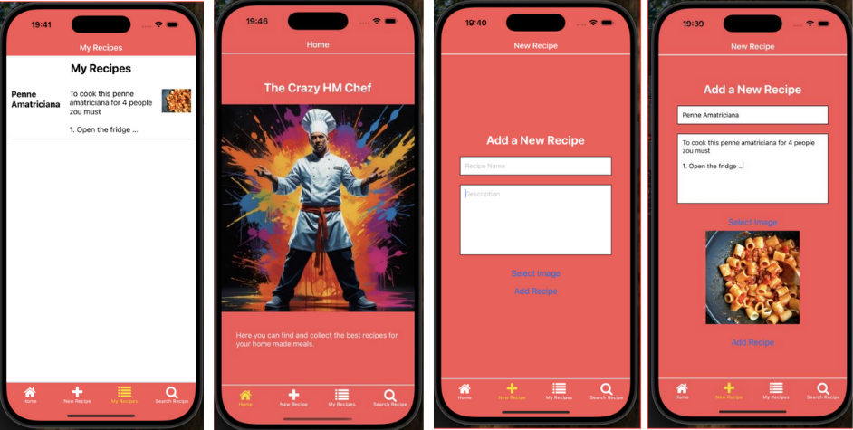

# 🍽️   The Crazy Chef

The Crazy Chef ist eine React Native App, mit der du Gerichte mit Rezepten speichern und hochladen kannst. Zusätzlich kannst du Rezepte aus einer gemeinsamen Datenbank entdecken.

## 🔑 Funktionen

📸 Foto & Rezept hochladen

📝 Zutaten & Schritte speichern

🌐 Zugriff auf andere Rezepte aus der Cloud

🧠 Formular leert sich automatisch nach dem Speichern

## 🛠️ Technik

React Native (TypeScript)

Context API

Lokaler & Online-Speicher
